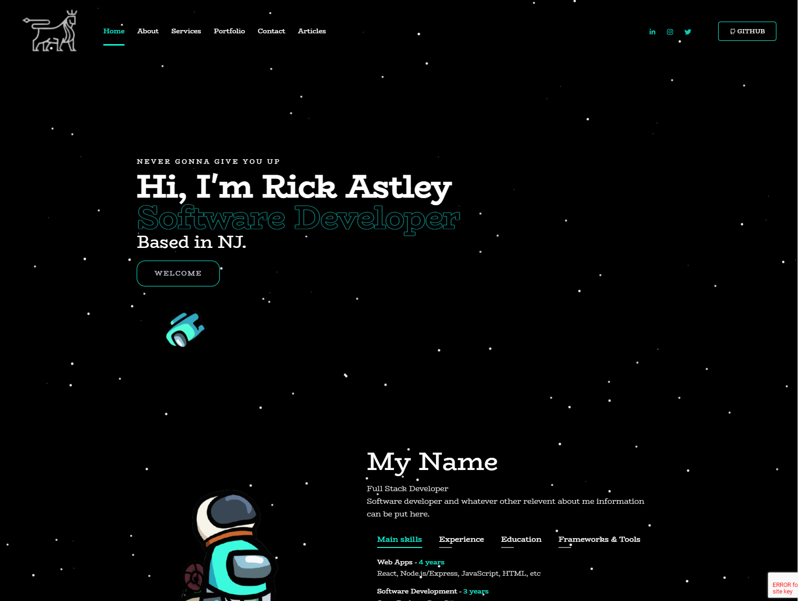
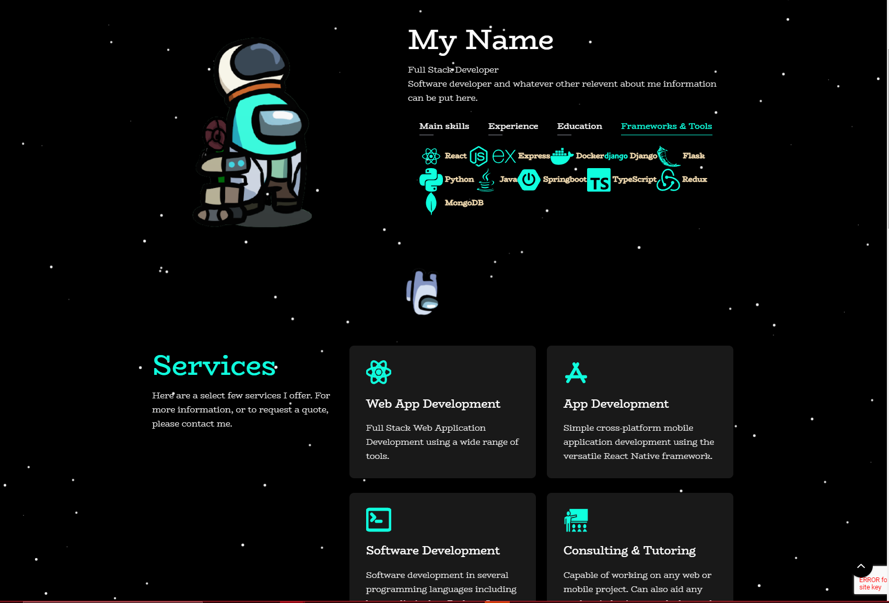
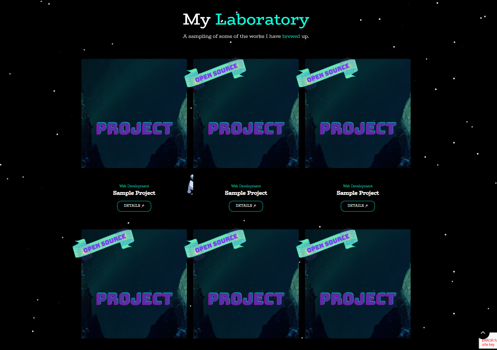
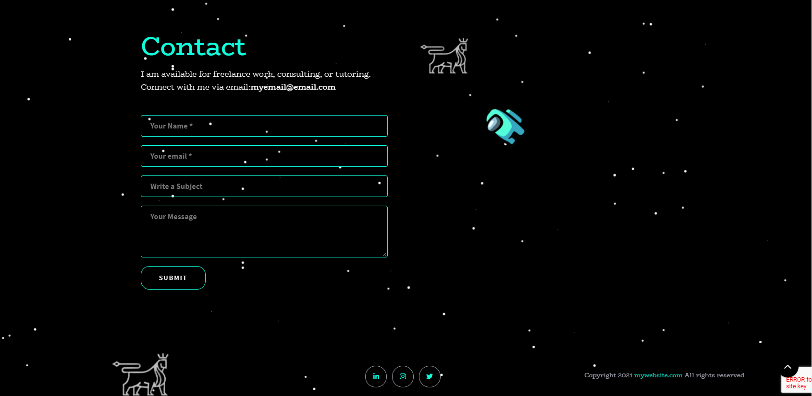
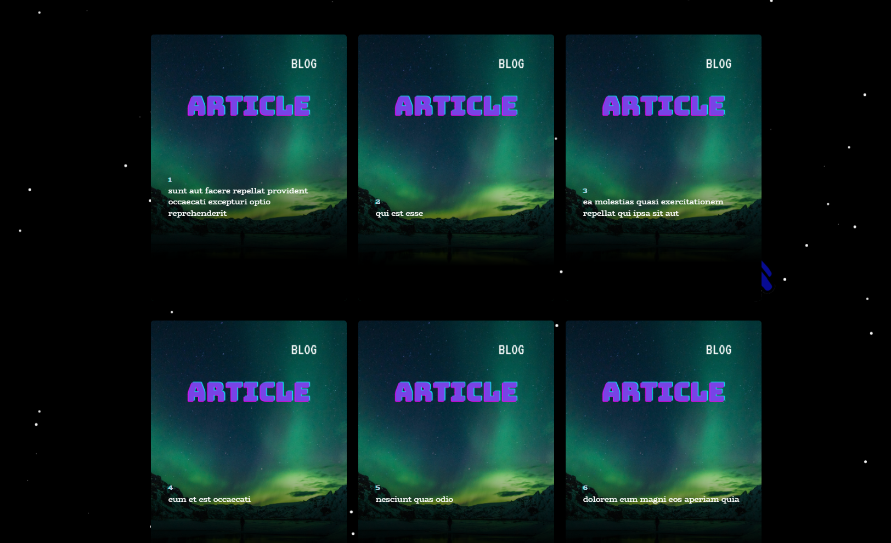

<h2>Animated Software Developer Portfolio Template</h2>
<h5>Includes blog and contact form</h5>

If you want your own customized logo I highly recommend 
using https://www.canva.com/

For how I managed to get my AmongUs Avatar, use this link:
https://www.amongusavatarcreator.com/

Favicon Generator:
https://favicon.io/favicon-converter/

# Getting Started with Vite
https://www.vitejs.dev/guide/

## Available Scripts

In the project directory, you can run:

### `pnpm run start` 
will run the app in the development mode. \
using Vite 